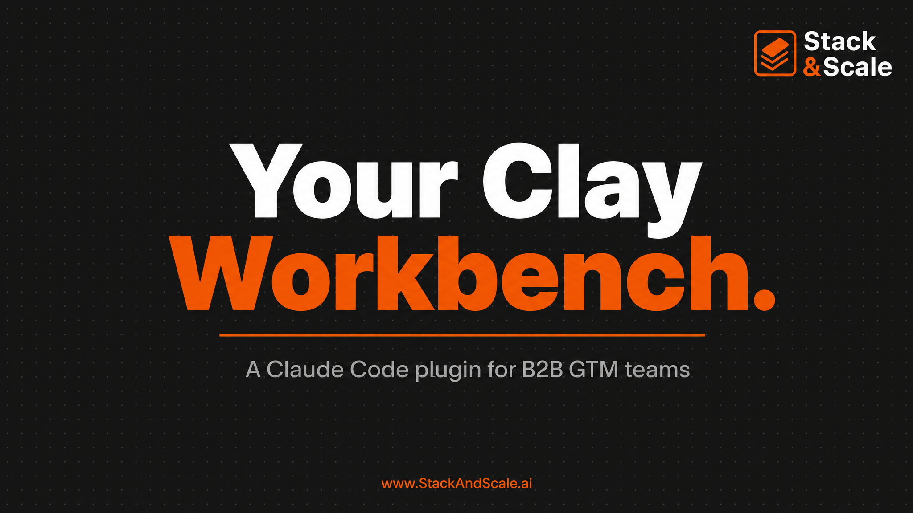

<p align="center">
  
</p>

# clay-workbench

> The complete Clay.com workbook plugin for Claude Code.

Build, debug, and run Clay workbooks end-to-end via Claude Code. Covers the full Clay workflow — pre-Clay list hygiene, ongoing CRM data hygiene, ABM list building, deep account + prospect research, multi-provider enrichment waterfalls, ICP fit scoring, composite buying-signal intent scoring, outbound copy with Sending Gate + sequencer push, real-time inbound routing, recurring trigger monitoring, Claygent prompt iteration, credit forecasting + provider comparison, portfolio-wide cost audit, single-workbook troubleshooting, and reusable workbook templates.

**Hybrid router + 16 sub-skills. MCP-first execution with manual UI walkthrough fallback. Mandatory credit pre-flight. ICP-gates-before-credits enforcement. Client-voice detection.**

---

## What this gives you

16 sub-skills organized by Clay workflow stage:

### 🧹 Hygiene & data quality

| Slash Command | What it builds |
|---------------|----------------|
| `/clay-list-clean` | Pre-Clay list hygiene — domain/email/title/geo normalization + dedup + suppression. Always run first on raw lists; cuts burn 30–60%. |
| `/clay-data-hygiene` | Ongoing CRM-side hygiene — 3 linked tables (`crm_record_health` rolling freshness + `crm_duplicates` weekly dedup + `refresh_queue` prioritized re-enrichment) |

### 🏗️ Build

| Slash Command | What it builds |
|---------------|----------------|
| `/clay-abm-list` | Account-keyed ABM workbook with firmographic + trigger gating |
| `/clay-account-research` | Deep multi-source account briefs — priorities + news + hiring + leadership + competitive + entry-point hypothesis per company |
| `/clay-prospect-research` | Deep person-level dossiers — POVs + activity + role scope + warm path + personalized entry line per contact |
| `/clay-enrich-waterfall` | Multi-provider email + phone + LinkedIn waterfall, graceful exit |

### 🎯 Score

| Slash Command | What it builds |
|---------------|----------------|
| `/clay-icp-score` | 10-point composite ICP fit score (firmographic + persona) with routing by band |
| `/clay-buying-signals` | Composite multi-source intent score — fuses 8+ signal sources (intent data, web visits, content engagement, hiring, funding, tech adoption, leadership moves) into one time-decayed "now is the moment" score with mandatory backfill discrimination test |

### 🚀 Activate

| Slash Command | What it builds |
|---------------|----------------|
| `/clay-outbound` | Personalized copy + Sending Gate + sequencer push, client-voice aware |
| `/clay-inbound-routing` | Real-time webhook enrichment + scoring + routing + Slack alerts |
| `/clay-signal-monitor` | Recurring single-source trigger monitoring (job changes / hiring / funding / leadership / tech adoption / intent) → severity classify → Slack/CRM routing |

### 🔍 Quality & cost

| Slash Command | What it builds |
|---------------|----------------|
| `/clay-claygent-iterator` | Structured 5 → 25 → 100 row Claygent prompt iteration loop with scorecard (PASS %, FABRICATED %, credits/row). Mandatory before scaling any Claygent column. |
| `/clay-credits` | Proactive credit forecasting + multi-mix provider cost comparison + workbook ROI ranking with reallocation rec |
| `/clay-cost-audit` | Portfolio-wide 12-check audit across every workbook (Global Rules violations + waste + ROI laggards) with executive / engineering / Slack output modes |
| `/clay-troubleshoot` | Diagnose broken / expensive / under-performing workbooks (single-workbook reactive) |

### 💾 Persistence

| Slash Command | What it builds |
|---------------|----------------|
| `/clay-template-library` | Save / load / list / diff / version / share workbook templates with anonymization rules. Catalog at `templates/library/INDEX.md`. |

### 🧭 Router

| Slash Command | What it builds |
|---------------|----------------|
| `/clay` | Master router — auto-detects intent, routes to the right sub-skill |

---

## Why it's different

Most Clay skills are either "consultancy markdown" (here are the steps) or "raw scripts" (here is the JSON). This one is both — and more:

- **MCP-first execution.** Calls `mcp__claude_ai_Clay__*` tools directly to actually run workbooks. Falls back to step-by-step UI walkthrough when MCP can't do it yet.
- **Mandatory credit pre-flight.** Estimates `rows × credits/row` against your current balance before ANY paid run > 100 rows. Blocks at 50% balance threshold by default.
- **Two-pass ICP gate as a global rule.** Cheap signals first (industry, size, geo); paid enrichments gated on pass 1. Typically cuts burn 40–60%.
- **Strict Sending Gate.** Sequencer push requires `sending_gate_eligible = TRUE` formula column. Per-step eligibility (step 1, step 2, LinkedIn) supported out of the box.
- **Client voice detection.** When the prompt mentions a known client (Obin, Vantage, etc.), routes to the matching messaging skill for ICP + voice. Generic otherwise.
- **3 golden reference workbooks.** Production-ready templates — copy/paste into Clay.
- **Action registry with gotchas.** The classic `actionKey: "ai"` silent-drop bug? Documented and avoided.

---

## The 8 Global Rules (Non-Negotiable)

Every sub-skill enforces these:

1. **Gates Before Credits** — ICP gate column required before any paid column
2. **Sending Gate Before Export** — formula column required before any sequencer push
3. **Data Unification** — score on full rows, not fragments
4. **ICP Qualification First** — cheapest-signal disqualification before enrichment
5. **Free Before Paid** — try free sources first in every waterfall
6. **Never Assume — Always Ask** — run the 8-question intake; offer options when user defers
7. **Clay-Managed vs Own API Key** — state which side each column hits
8. **Multiple Sending Steps** — outbound assumes 2–4 step cadence, not one-shot

Violation requires explicit `gate-override: <reason>` declaration.

---

## Installation

### Option A — Clone + register all 16 slash commands

```bash
git clone https://github.com/guerrilla2799/clay-workbench ~/.claude/claudecodeskills/clay-workbench
```

Then register each slash command:

```bash
SKILLS=(
  clay-list-clean
  clay-data-hygiene
  clay-abm-list
  clay-account-research
  clay-prospect-research
  clay-enrich-waterfall
  clay-icp-score
  clay-buying-signals
  clay-outbound
  clay-inbound-routing
  clay-signal-monitor
  clay-claygent-iterator
  clay-credits
  clay-cost-audit
  clay-troubleshoot
  clay-template-library
)

# Master router
cat > ~/.claude/commands/clay.md <<'EOF'
---
allowed-tools: Read, Write, Edit, WebSearch, WebFetch, AskUserQuestion, Glob, Grep, Bash
description: clay-workbench — master router
---

$ARGUMENTS

See ~/.claude/claudecodeskills/clay-workbench/SKILL.md for full instructions.
EOF

# Sub-skills
for skill in "${SKILLS[@]}"; do
  cat > ~/.claude/commands/${skill}.md <<EOF
---
allowed-tools: Read, Write, Edit, WebSearch, WebFetch, AskUserQuestion, Glob, Grep, Bash
description: clay-workbench — ${skill}
---

\$ARGUMENTS

See ~/.claude/claudecodeskills/clay-workbench/skills/${skill}/SKILL.md for full instructions.
EOF
done
```

### Option B — Install as a Claude Code plugin

The `.claude-plugin/plugin.json` manifest is included for plugin-manager-based installs. Drop the folder into your Claude Code plugins directory.

### Required: Clay MCP server

This plugin assumes the **official Clay MCP server** is connected (`mcp__claude_ai_Clay__*` tools). If not:

1. Connect at https://claude.ai/settings/connectors (or your equivalent Claude Code MCP config)
2. Authenticate with your Clay workspace
3. Verify with `mcp__claude_ai_Clay__list_subroutines` — should return your subroutines

Without the MCP server, the plugin falls back to manual UI walkthroughs (which work but lose live execution).

---

## Quick start

```
# Pick your motion. Auto-router will pick the right sub-skill if you're unsure.
/clay

# Or jump to a specific sub-skill (sampling across stages):

# Hygiene
/clay-list-clean dedupe + suppress my Apollo export before any paid enrichment

/clay-data-hygiene stand up ongoing dedup + decay detection on my HubSpot CRM —
                  daily freshness scan, weekly dedup, rolling refresh queue

# Build
/clay-abm-list build a Tier 1 ABM list of B2B SaaS companies with 500-2500 employees
              that closed a Series A or B in the last 90 days

/clay-account-research generate executive briefs for my Tier 1 list —
                      priorities + news + hiring + entry-point hypothesis

/clay-prospect-research deep dossier on these 25 named champions, with personalized
                        first-line drafts ready to hand to /clay-outbound

/clay-enrich-waterfall add an email + phone waterfall to my contacts table —
                      budget is 10¢/row, EU-heavy list, need 80% match rate

# Score
/clay-icp-score build a 10-point fit score for my MQL routing —
                back-test against last 12 months closed-won

/clay-buying-signals fuse 6sense + Bombora + web reveal + hiring + funding into
                    one composite intent score — discriminate vs closed-won/lost

# Activate
/clay-outbound generate 4-step cold outbound copy from my T1 contacts table,
              push to SalesLoft, voice is Obin AI

/clay-inbound-routing wire up real-time enrichment + routing on my HubSpot demo form

/clay-signal-monitor stand up a daily job-change watcher across my Champion alumni
                    list with severity-tiered Slack routing

# Quality & cost
/clay-claygent-iterator tune this Claygent prompt before I scale to 500 rows —
                       run the 5/25/100 loop, give me the scorecard

/clay-credits should I add ZoomInfo own-key, or upgrade Clay tier? Show me the
              math on 50k contacts/quarter at current burn

/clay-cost-audit monthly portfolio audit — run all 12 checks across every
                workbook, rank fixes by savings

/clay-troubleshoot my email waterfall is burning $400/day with 30% match rate —
                   diagnose and fix

# Persistence
/clay-template-library save the Obin Tier 1 ABM workbook as an anonymized template
                      for reuse across other clients
```

---

## Plugin structure

```
clay-workbench/
├── SKILL.md                            # Master router
├── .claude-plugin/
│   └── plugin.json                     # Formal plugin manifest (v2.0.0)
├── skills/                             # 16 sub-skills
│   ├── clay-list-clean/SKILL.md        # Hygiene
│   ├── clay-data-hygiene/SKILL.md
│   ├── clay-abm-list/SKILL.md          # Build
│   ├── clay-account-research/SKILL.md
│   ├── clay-prospect-research/SKILL.md
│   ├── clay-enrich-waterfall/SKILL.md
│   ├── clay-icp-score/SKILL.md         # Score
│   ├── clay-buying-signals/SKILL.md
│   ├── clay-outbound/SKILL.md          # Activate
│   ├── clay-inbound-routing/SKILL.md
│   ├── clay-signal-monitor/SKILL.md
│   ├── clay-claygent-iterator/SKILL.md # Quality & cost
│   ├── clay-credits/SKILL.md
│   ├── clay-cost-audit/SKILL.md
│   ├── clay-troubleshoot/SKILL.md
│   └── clay-template-library/SKILL.md  # Persistence
├── resources/
│   ├── global-rules.md
│   ├── intake-questions.md
│   ├── mcp-tool-map.md
│   ├── action-registry.md
│   ├── credit-cost-table.md
│   ├── client-context-detection.md
│   ├── clayscript-library.md
│   ├── ai-prompt-templates.md
│   ├── enrichment-benchmarks.md
│   ├── claygent-guide.md
│   └── workflow-patterns.md
├── providers/                          # Per-provider notes
│   ├── enrichment/                     # Apollo, Findymail, Datagma, Dropcontact, ZeroBounce, Hunter, PDL, Clearbit, ContactOut
│   ├── databases/                      # Sales Nav, Ocean.io
│   ├── signals/                        # Predictleads, job changes, hiring/funding
│   ├── crm/                            # HubSpot, Salesforce
│   └── sequencers/                     # SalesLoft, Outreach, Apollo, 11x, Smartlead/Instantly
└── templates/                          # Reference workbooks + reusable library
    ├── 01-abm-tier1-with-triggers.md
    ├── 02-inbound-demo-enricher-router.md
    ├── 03-cold-outbound-multi-provider-waterfall.md
    └── library/                        # Versioned templates from /clay-template-library
        └── INDEX.md                    # Registry of saved templates
```

Auto-generated cross-template composition graph + per-template column DAGs live in [`docs/composition/`](docs/composition/) (regenerate via `python3 scripts/compose-graph.py`).

---

## Design provenance

Composed from the best patterns across the Claude Code Clay ecosystem:

| Pattern | Source |
|---------|--------|
| Master + sub-skill split with routing table | forma-norden/clay-claude-code-skill-pack |
| 8 Global Rules (Gates Before Credits, etc.) | mariosworkflows/clay-engineer |
| 8-question mandatory intake | LirKonu/clay-campaign |
| Action registry + verification pattern | TenSpy-ai/claycast |
| Pre-built workflow patterns | sachacoldiq/ColdIQ-s-GTM-Skills |
| Standalone + cross-link footer | ColdIQ |

The four load-bearing patterns: forma's routing table, clay-engineer's Global Rules, clay-campaign's 8-Q intake, claycast's action registry.

---

## What it WON'T do

- Build a workbook without running the 8-question intake first
- Add paid columns before an ICP gate exists
- Push to a sequencer without a Sending Gate column
- Run anything with `auto_run = true` during construction
- Generate outbound copy without confirming voice / client context
- Skip the credit pre-flight on runs > 100 rows

These are by design. Override per case with `gate-override: <reason>`.

---

## Roadmap

v2.0.0 (this release):
- [x] Subroutine save / load — shipped as `/clay-template-library` with anonymization rules, versioning, INDEX.md catalog
- [x] Cost analytics dashboard — shipped as `/clay-credits` (forecast + provider comparison + workbook ROI) and `/clay-cost-audit` (portfolio-wide 12-check audit)
- [x] Claygent prompt iteration loop — shipped as `/clay-claygent-iterator` (5 → 25 → 100 row loop with scorecard)
- [x] Backfill pattern: detect existing workbooks missing Global Rules — shipped as `/clay-cost-audit`
- [x] Deep research layer — shipped as `/clay-account-research` + `/clay-prospect-research`
- [x] Monitoring layer — shipped as `/clay-signal-monitor` (single source) + `/clay-buying-signals` (multi-source composite)
- [x] Data hygiene layer — shipped as `/clay-list-clean` (pre-Clay) + `/clay-data-hygiene` (ongoing CRM)

Post-v2.0.0 polish + roadmap (shipped 2026-06-10):
- [x] `resources/global-rules.md` cross-refs to all 10 new sub-skills under each rule
- [x] `templates/library/` seeded with 10 bootstrap templates (`abm-account-keyed-tier-1`, `account-research-tier-1-brief`, `email-waterfall-eu`, `email-waterfall-us-smb`, `inbound-router-demo-form`, `outbound-3-step-cadence-cold`, `outbound-3-step-cadence-warm`, `prospect-research-champion-brief`, `signal-monitor-hiring-posture`, `signal-monitor-job-change`) + stage-grouped INDEX.md catalog
- [x] **Subroutine export** — EXPORT mode added to `/clay-template-library` for automated round-trip from a live Clay subroutine or table → portable `template.json` with workspace-portability transforms + anonymization applied
- [x] **Community templates via PR** — `CONTRIBUTING.md` + `.github/PULL_REQUEST_TEMPLATE.md` + `scripts/validate-template.py` (stdlib only; schema + anonymization checks)
- [x] **Cross-workbook composition visualizer** — `scripts/compose-graph.py` reads `templates/library/*/template.json` and emits Mermaid graphs at `docs/composition/library-graph.md` + `docs/composition/per-template/<slug>.md`; idempotent with `--check` flag for CI drift detection

Next:
- [ ] **Schema operations** — create new tables via MCP when Clay exposes the API. *Blocked on Clay exposing a write API for tables; out of our hands until then.*

---

## Contributing

PRs welcome — especially anonymized templates for `templates/library/`. See [CONTRIBUTING.md](CONTRIBUTING.md) for the template contribution workflow, the anonymization checklist, and the local validator script.

## License

MIT — see [LICENSE](LICENSE).

## Author

[Brandon Redlinger](https://stackandscale.ai) — Fractional VP Marketing / GTM engineer.

Built for the Stack & Scale audience: GTM operators who think in systems, not tactics.
