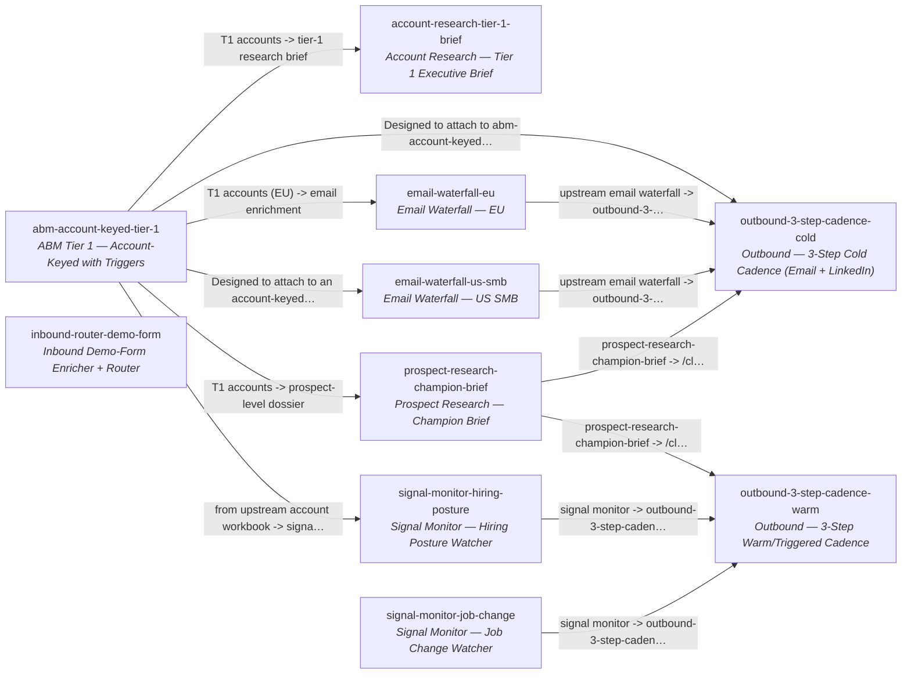

<!-- AUTO-GENERATED by scripts/compose-graph.py — do not edit by hand -->

# Cross-template composition graph

Graph of 10 templates and 12 inferred cross-template edges, derived from `template.json` descriptions, column notes, and action notes.

## Edge legend

Edges are inferred from three signals: (1) a template's `template.description` or `notes` explicitly naming another template's slug; (2) phrases like `from upstream <X>` that imply a known class of upstream template; (3) phrases like `ready to hand to /clay-outbound` that imply a downstream cadence template.

## Templates

| Slug | Name | Use case | Motion |
|------|------|----------|--------|
| [`abm-account-keyed-tier-1`](per-template/abm-account-keyed-tier-1.md) | ABM Tier 1 — Account-Keyed with Triggers | abm-list | slg |
| [`account-research-tier-1-brief`](per-template/account-research-tier-1-brief.md) | Account Research — Tier 1 Executive Brief | research | slg |
| [`email-waterfall-eu`](per-template/email-waterfall-eu.md) | Email Waterfall — EU | enrichment | slg |
| [`email-waterfall-us-smb`](per-template/email-waterfall-us-smb.md) | Email Waterfall — US SMB | enrichment | slg |
| [`inbound-router-demo-form`](per-template/inbound-router-demo-form.md) | Inbound Demo-Form Enricher + Router | inbound | hybrid |
| [`outbound-3-step-cadence-cold`](per-template/outbound-3-step-cadence-cold.md) | Outbound — 3-Step Cold Cadence (Email + LinkedIn) | outbound | slg |
| [`outbound-3-step-cadence-warm`](per-template/outbound-3-step-cadence-warm.md) | Outbound — 3-Step Warm/Triggered Cadence | outbound | hybrid |
| [`prospect-research-champion-brief`](per-template/prospect-research-champion-brief.md) | Prospect Research — Champion Brief | research | slg |
| [`signal-monitor-hiring-posture`](per-template/signal-monitor-hiring-posture.md) | Signal Monitor — Hiring Posture Watcher | monitoring | hybrid |
| [`signal-monitor-job-change`](per-template/signal-monitor-job-change.md) | Signal Monitor — Job Change Watcher | monitoring | hybrid |

