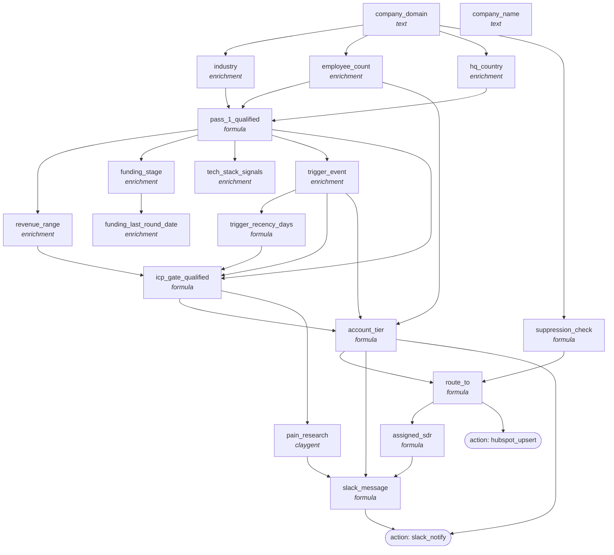

<!-- AUTO-GENERATED by scripts/compose-graph.py — do not edit by hand -->

# ABM Tier 1 — Account-Keyed with Triggers

**Slug:** `abm-account-keyed-tier-1`  
**Use case:** abm-list  
**Motion:** slg  
**Cost/row:** 14 credits per qualified account (most disqualify at pass_1)  
**Match rate:** 25% pass_1 qualified, 5-10% T1

Account-keyed ABM workbook with two-pass ICP gate, trigger-event qualification, tier scoring, and routing to SDR queue / nurture / programmatic.

## Internal column DAG

19 columns, 30 dependency edges (including action triggers).

## Cross-template links

### Fed by

_None inferred. This template is a top-of-funnel source._

### Feeds into

- [`account-research-tier-1-brief`](account-research-tier-1-brief.md)
- [`email-waterfall-eu`](email-waterfall-eu.md)
- [`email-waterfall-us-smb`](email-waterfall-us-smb.md)
- [`outbound-3-step-cadence-cold`](outbound-3-step-cadence-cold.md)
- [`prospect-research-champion-brief`](prospect-research-champion-brief.md)
- [`signal-monitor-hiring-posture`](signal-monitor-hiring-posture.md)

