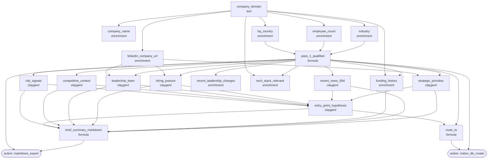

<!-- AUTO-GENERATED by scripts/compose-graph.py — do not edit by hand -->

# Account Research — Tier 1 Executive Brief

**Slug:** `account-research-tier-1-brief`  
**Use case:** research  
**Motion:** slg  
**Cost/row:** 40-70 credits per Tier 1 account at STANDARD depth  
**Match rate:** 95%+ firmographic; 80%+ usable strategic priorities

Multi-source Claygent account brief generator. Per-account: strategic priorities + recent news + funding history + hiring posture + leadership + competitive context + product launches + risk signals + entry-point hypothesis. Output: in-Clay summary + optional Markdown export per account.

## Internal column DAG

19 columns, 42 dependency edges (including action triggers).

## Cross-template links

### Fed by

- [`abm-account-keyed-tier-1`](abm-account-keyed-tier-1.md)

### Feeds into

_None inferred. This template is terminal._

