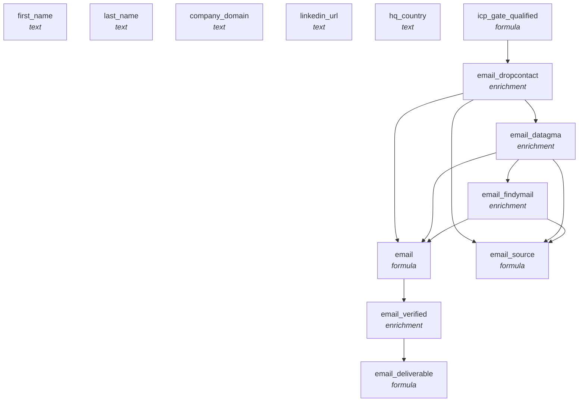

<!-- AUTO-GENERATED by scripts/compose-graph.py — do not edit by hand -->

# Email Waterfall — EU

**Slug:** `email-waterfall-eu`  
**Use case:** enrichment  
**Motion:** slg  
**Cost/row:** 5-7 credits per contact  
**Match rate:** 70-80% on EU ICPs (vs ~50% if Apollo-led)

Contact-keyed email waterfall optimized for EU ICPs. Dropcontact → Datagma → Findymail, with ZeroBounce verification. Dropcontact leads because of better GDPR-compliance + higher EU match rate.

## Internal column DAG

13 columns, 11 dependency edges (including action triggers).

## Cross-template links

### Fed by

- [`abm-account-keyed-tier-1`](abm-account-keyed-tier-1.md)

### Feeds into

- [`outbound-3-step-cadence-cold`](outbound-3-step-cadence-cold.md)

