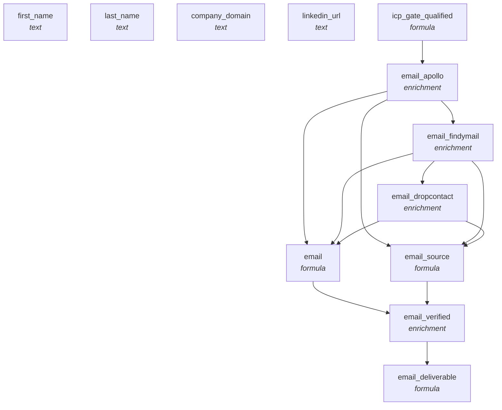

<!-- AUTO-GENERATED by scripts/compose-graph.py — do not edit by hand -->

# Email Waterfall — US SMB

**Slug:** `email-waterfall-us-smb`  
**Use case:** enrichment  
**Motion:** slg  
**Cost/row:** 4-6 credits per contact  
**Match rate:** 80-90% on US SMB ICPs

Contact-keyed email waterfall optimized for US SMB ICPs. Apollo → Findymail → Dropcontact, with ZeroBounce verification on uncertain matches. Designed to attach to an account-keyed source like abm-account-keyed-tier-1.

## Internal column DAG

12 columns, 12 dependency edges (including action triggers).

## Cross-template links

### Fed by

- [`abm-account-keyed-tier-1`](abm-account-keyed-tier-1.md)

### Feeds into

- [`outbound-3-step-cadence-cold`](outbound-3-step-cadence-cold.md)

