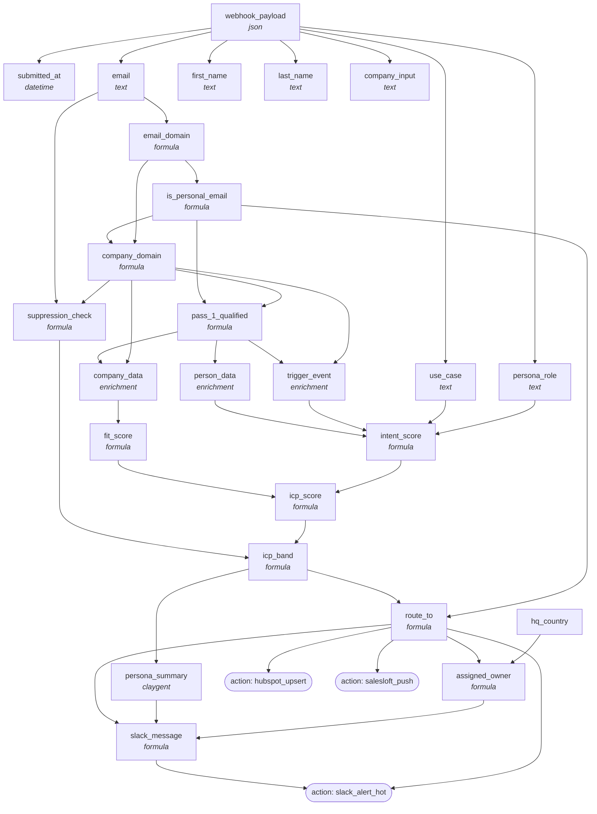

<!-- AUTO-GENERATED by scripts/compose-graph.py — do not edit by hand -->

# Inbound Demo-Form Enricher + Router

**Slug:** `inbound-router-demo-form`  
**Use case:** inbound  
**Motion:** hybrid  
**Cost/row:** 8 credits per form fill average  
**Match rate:** Pass_1 ~85% (excludes personal-email); ICP-Hot ~10-15%

Real-time webhook → enrich → score → route → Slack/SalesLoft/HubSpot. Hot leads to round-robin SDR within 60s of form submit; warm to nurture; cold to self-serve; personal-email to nurture pool.

## Internal column DAG

24 columns, 41 dependency edges (including action triggers).

## Cross-template links

### Fed by

_None inferred. This template is a top-of-funnel source._

### Feeds into

_None inferred. This template is terminal._

