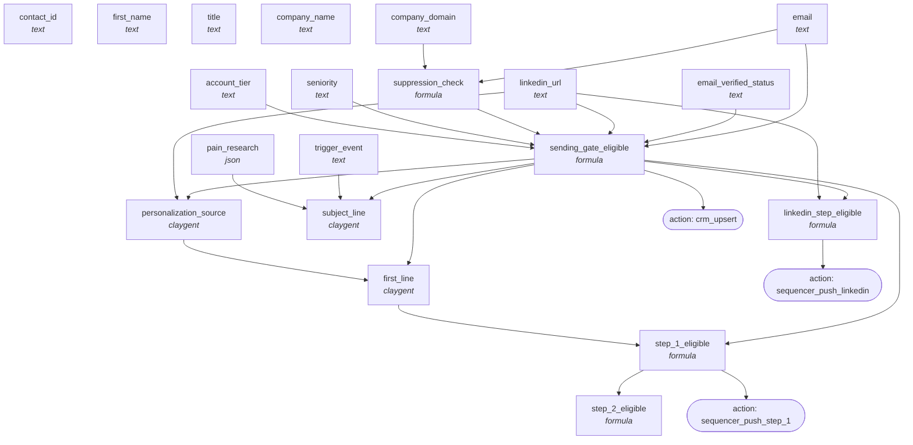

<!-- AUTO-GENERATED by scripts/compose-graph.py — do not edit by hand -->

# Outbound — 3-Step Cold Cadence (Email + LinkedIn)

**Slug:** `outbound-3-step-cadence-cold`  
**Use case:** outbound  
**Motion:** slg  
**Cost/row:** 10-12 credits per contact at the Claygent layer (assumes email waterfall ran upstream)  
**Match rate:** Sending Gate pass rate: 50-70% of enriched rows; Read-Out-Loud pass on first lines: target 18/20

Contact-keyed cold outbound workbook. Takes a verified-email contact list, generates per-contact first line + subject line via Claygent, gates strictly on Sending Gate, and pushes to a sequencer with per-step eligibility (email-1, LinkedIn-connect, email-2). Designed to attach to abm-account-keyed-tier-1 + an email waterfall.

## Internal column DAG

20 columns, 23 dependency edges (including action triggers).

## Cross-template links

### Fed by

- [`abm-account-keyed-tier-1`](abm-account-keyed-tier-1.md)
- [`email-waterfall-eu`](email-waterfall-eu.md)
- [`email-waterfall-us-smb`](email-waterfall-us-smb.md)
- [`prospect-research-champion-brief`](prospect-research-champion-brief.md)

### Feeds into

_None inferred. This template is terminal._

