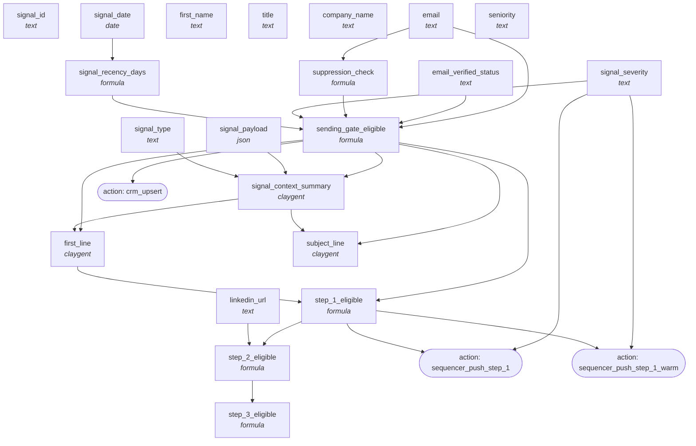

<!-- AUTO-GENERATED by scripts/compose-graph.py — do not edit by hand -->

# Outbound — 3-Step Warm/Triggered Cadence

**Slug:** `outbound-3-step-cadence-warm`  
**Use case:** outbound  
**Motion:** hybrid  
**Cost/row:** 10-14 credits per signal-triggered contact at Claygent layer  
**Match rate:** Sending Gate pass rate: 70-85% (warm signals are pre-qualified upstream); Read-Out-Loud pass on first lines: target 19/20

Signal-driven warm outbound variant of outbound-3-step-cadence-cold. Attaches to a signal-monitor (job-change, hiring, funding) and inherits the signal context into the first line. Tighter Sending Gate (signal severity = HOT or WARM required); explicit signal_context block fed into Claygent for first-line generation.

## Internal column DAG

21 columns, 24 dependency edges (including action triggers).

## Cross-template links

### Fed by

- [`prospect-research-champion-brief`](prospect-research-champion-brief.md)
- [`signal-monitor-hiring-posture`](signal-monitor-hiring-posture.md)
- [`signal-monitor-job-change`](signal-monitor-job-change.md)

### Feeds into

_None inferred. This template is terminal._

