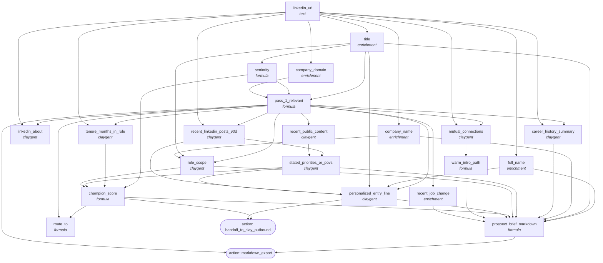

<!-- AUTO-GENERATED by scripts/compose-graph.py — do not edit by hand -->

# Prospect Research — Champion Brief

**Slug:** `prospect-research-champion-brief`  
**Use case:** research  
**Motion:** slg  
**Cost/row:** 45-75 credits per prospect at STANDARD depth  
**Match rate:** 95%+ contact enrichment; 70%+ usable personalized entry line

Person-level deep dossier generator. Per-contact: career history + recent LinkedIn activity + public POVs + role scope + mutual connections + recent job change + personalized entry line + warm intro path. Output: champion brief markdown ready to hand to /clay-outbound or AE 1:1 prep.

## Internal column DAG

21 columns, 51 dependency edges (including action triggers).

## Cross-template links

### Fed by

- [`abm-account-keyed-tier-1`](abm-account-keyed-tier-1.md)

### Feeds into

- [`outbound-3-step-cadence-cold`](outbound-3-step-cadence-cold.md)
- [`outbound-3-step-cadence-warm`](outbound-3-step-cadence-warm.md)

