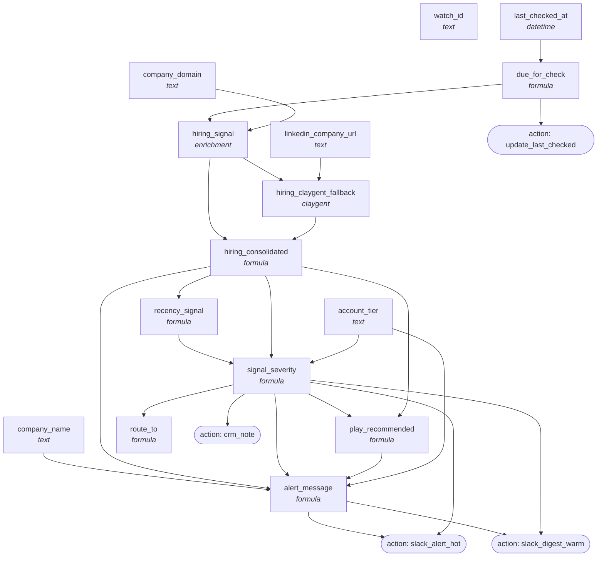

<!-- AUTO-GENERATED by scripts/compose-graph.py — do not edit by hand -->

# Signal Monitor — Hiring Posture Watcher

**Slug:** `signal-monitor-hiring-posture`  
**Use case:** monitoring  
**Motion:** hybrid  
**Cost/row:** 3-7 credits per watched account per refresh cycle  
**Match rate:** Predictleads ~90% on US accounts; Claygent fallback ~70%

Recurring weekly hiring-trigger monitor across an ICP account watchlist. Detects when target accounts start hiring for the role categories that buy your product (e.g. RevOps Director, Head of GTM Engineering). Predictleads or Claygent LinkedIn jobs scan; severity-tiered routing.

## Internal column DAG

15 columns, 25 dependency edges (including action triggers).

## Cross-template links

### Fed by

- [`abm-account-keyed-tier-1`](abm-account-keyed-tier-1.md)

### Feeds into

- [`outbound-3-step-cadence-warm`](outbound-3-step-cadence-warm.md)

