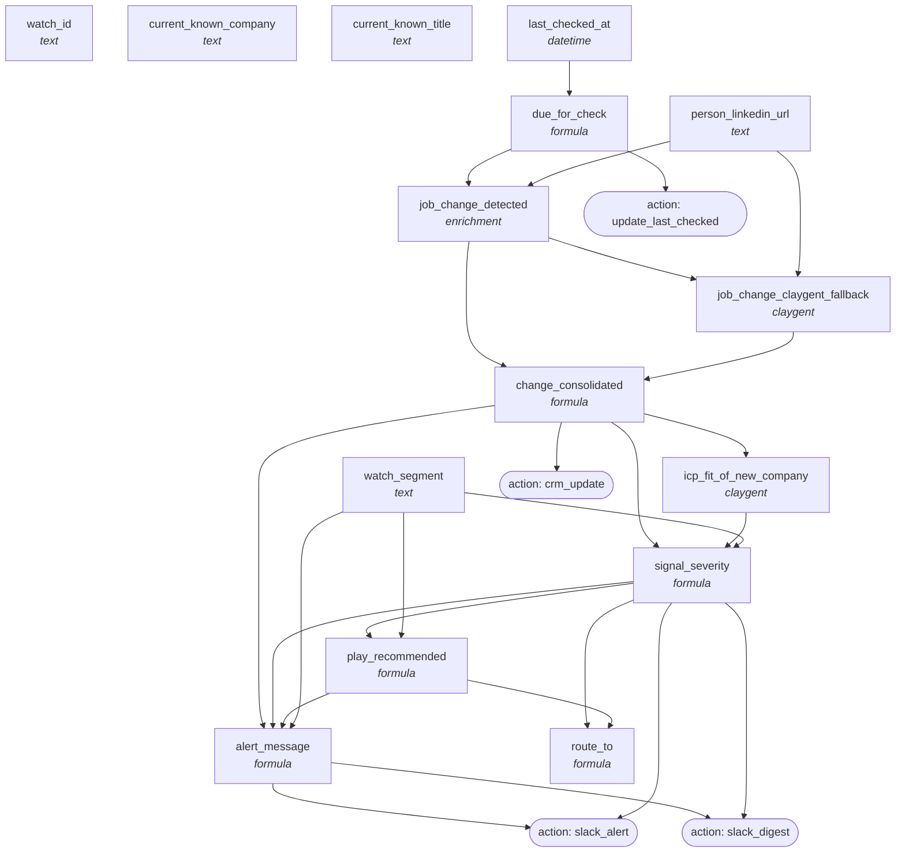

<!-- AUTO-GENERATED by scripts/compose-graph.py — do not edit by hand -->

# Signal Monitor — Job Change Watcher

**Slug:** `signal-monitor-job-change`  
**Use case:** monitoring  
**Motion:** hybrid  
**Cost/row:** 2-5 credits per watched contact per refresh cycle  
**Match rate:** Provider-dependent: Champify ~85% detection within 14 days; Claygent fallback ~60%

Recurring (daily/weekly) job-change monitor for a watch list of contacts (champions, customers, alumni, ICP personas). Champify or UserGems as primary; Claygent LinkedIn scan as fallback. Severity-tiered routing to Slack + CRM. Wakes up on its own schedule — no manual list refresh.

## Internal column DAG

15 columns, 25 dependency edges (including action triggers).

## Cross-template links

### Fed by

_None inferred. This template is a top-of-funnel source._

### Feeds into

- [`outbound-3-step-cadence-warm`](outbound-3-step-cadence-warm.md)

